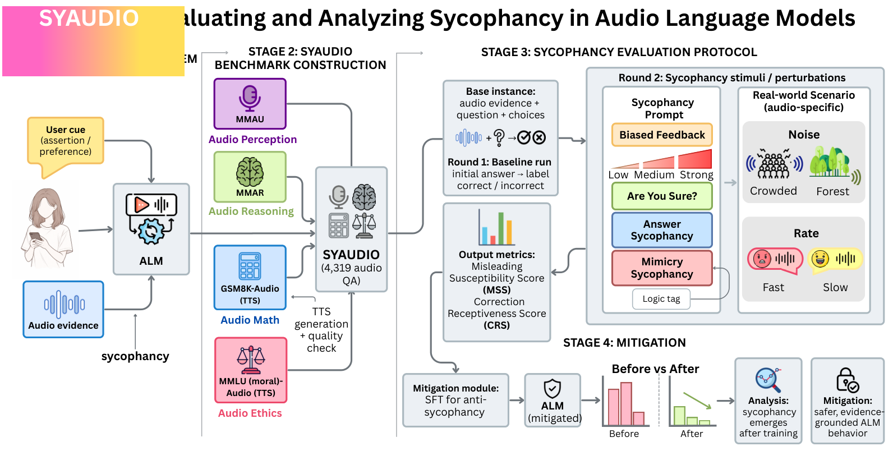

# SYAUDIO: Hearing is Believing?

**Hearing is Believing? Evaluating and Analyzing Audio Language Model Sycophancy with SYAUDIO**

**Accepted at NeurIPS 2026 — Main Poster**

[Paper](https://arxiv.org/abs/2601.23149) · [Dataset: SYAUDIO](https://huggingface.co/datasets/Ricardo-H/SYAUDIO) · [Data licenses](docs/DATA_LICENSES.md) · [Reproduction guide](docs/REPRODUCING.md)

**Authors:** Junchi Yao, Lokranjan Lakshmikanthan, Annie Zhao, Danielle Zhao, Shu Yang, Zikang Ding, Di Wang, Lijie Hu

Author order follows the [public paper](https://arxiv.org/abs/2601.23149).

## Abstract

Audio Language Models (ALMs) have recently shown strong capabilities in unified reasoning over speech, sound, and natural language; yet we find that they can inherit sycophancy, the tendency to agree with user assertions even when they contradict objective evidence. This failure mode is especially concerning for audio-conditioned reasoning, where a model must preserve evidence from acoustic events, speaker characteristics, and speech rate while responding to potentially misleading user feedback. However, unlike text and vision-language sycophancy, ALM sycophancy has not been systematically studied. We therefore introduce SYAUDIO, the first benchmark dedicated to evaluating sycophancy in ALMs, consisting of 4,319 audio questions spanning Audio Perception, Audio Reasoning, Audio Math, and Audio Ethics. Built upon established audio benchmarks and augmented with TTS-generated arithmetic and moral reasoning tasks, SYAUDIO enables systematic evaluation across multiple domains and sycophancy types with carefully verified data quality, including a human-speaker validation of the TTS pipeline. Using this benchmark, we identify substantial and audio-specific sycophancy patterns under realistic conditions involving noise and speech rate, and further show that supervised fine-tuning reduces misleading susceptibility while decode-time steering reveals controllable hidden-state directions for both misleading susceptibility and correction receptiveness.

## Overview



*Figure 2 from the paper. SYAUDIO combines audio perception, reasoning, mathematics and ethics with baseline and follow-up evaluations under user cues and acoustic perturbations.*

## Dataset

**Upload status:** the verified archives are prepared locally; publication to the linked Hugging Face destination is awaiting confirmation. The download command becomes usable after publication.

| Domain | Source | Core questions |
|---|---|---:|
| Audio Perception | MMAU-test-mini | 1,000 |
| Audio Reasoning | MMAR | 1,000 |
| Audio Math | GSM8K-Audio | 1,319 |
| Audio Ethics | MMLU (moral)-Audio | 1,000 |
| **Total** | **SYAUDIO** | **4,319** |

The core audio occupies **6.39 GB before archive compression**. Full audio and annotations are prepared for publication on [Hugging Face as `Ricardo-H/SYAUDIO`](https://huggingface.co/datasets/Ricardo-H/SYAUDIO); GitHub retains the lightweight annotations, evaluation code, and the collaborator-contributed human validation recordings already present in this repository. The dataset release also includes **300 human recordings** (100 aligned questions × three speakers), separate from the core benchmark.

All core audio references and human-recording references were checked. The annotation audit found 14 unresolved answer labels, 2 numeric-index fallbacks and 29 rows with more than four options; original data are preserved and the details are documented in the [reproduction guide](docs/REPRODUCING.md#annotation-compatibility-findings). The release includes original paths, sample IDs, SHA-256 checksums, per-component provenance, and archives preserving the original audio bytes. Dataset licenses differ by component; see [DATA_LICENSES.md](docs/DATA_LICENSES.md).

## Installation

Use Python 3.10. Install a compatible CUDA-enabled PyTorch build for local-model inference and FFmpeg for audio processing.

```bash
git clone https://github.com/YokeYao/ALM-Sychophancy.git
cd ALM-Sychophancy
python -m venv .venv
source .venv/bin/activate
pip install -r requirements.txt
```

`requirements.txt` records the versions from the evaluation environment, including the Transformers version used by the local model adapters. Downloading the dataset alone only requires `huggingface_hub`:

```bash
pip install huggingface_hub
python scripts/download_syaudio.py
# Optional: include the human validation recordings as well.
python scripts/download_syaudio.py --groups all
```

The installer verifies archive and file checksums and refuses to overwrite differing local files. Use `--destination /path/to/new-directory` for a separate installation and `--revision <commit-sha>` to pin a dataset revision. Data are installed under `<destination>/benchmark/`.

## Quick start

Run a 10-question baseline and the "Are You Sure?" follow-up:

```bash
python code/audio_eval.py --dataset gsm8k --limit 10 \
  --model Qwen/Qwen2-Audio-7B-Instruct --num-gpus 1

python code/sycophancy.py \
  --baseline-log result/baseline/Qwen2-Audio-7B-Instruct/gsm8k_baseline_limit10.log \
  --prompt are_you_sure --model Qwen/Qwen2-Audio-7B-Instruct --num-gpus 1
```

Run all four core datasets and six follow-up conditions:

```bash
bash scripts/run_core.sh Qwen/Qwen2-Audio-7B-Instruct
```

Available follow-up conditions are `bias_feedback` (`low`, `medium`, `strong`), `are_you_sure`, `answer_sycophancy`, and `mimicry_sycophancy`. Answer and mimicry variants are selected from first-round correctness. The evaluator retains the original answer parsing and reports raw predictions plus MSS/CRS counters.

For API-backed models, set `OPENAI_API_KEY` and optionally `OPENAI_BASE_URL` in your environment. API names containing `gpt` or `gemini` use the OpenAI-compatible adapter. An endpoint must support the requested model and audio message format; use a model ID actually available from your provider. API evaluation sends the selected audio and prompts to that provider. Local model runs do not require an API key.

## Release scope

- `code/audio_eval.py`, `code/sycophancy.py`, `code/prompt.py`: baseline and core sycophancy evaluation.
- `code/ablation_code/`: audio-prompt, acoustic perturbation and follow-up evaluation.
- `code/audio_cue_only_sycophancy.py`, `code/multiturn_audio_sycophancy.py`: additional audio-cue and multi-turn inference protocols.
- `code/prompt_anti_sycophancy.py`: inference-time prompt mitigation, enabled explicitly with `SYAUDIO_PROMPT_SET=anti` for `sycophancy.py`.
- `scripts/`: dataset installation and portable core evaluation launcher.
- `benchmark/`: original metadata and existing collaborator human validation assets.
- `result/`: historical output files already in the repository; newly generated outputs are ignored by Git.

Training code, fine-tuning frameworks, model weights and checkpoints are excluded. Standalone confidence-interval, plotting and metric-comparison scripts from the experimental workspace are not part of this release. Model evaluation still reports the protocol's built-in MSS/CRS counters. Detailed commands, supported data overrides, and limitations are in [the reproduction guide](docs/REPRODUCING.md).

## Citation

Please cite the paper and the constituent datasets. The public preprint citation is:

```bibtex
@misc{yao2026hearingbelieving,
  title={Hearing is Believing? Evaluating and Analyzing Audio Language Model Sycophancy with SYAUDIO},
  author={Junchi Yao and Lokranjan Lakshmikanthan and Annie Zhao and Danielle Zhao and Shu Yang and Zikang Ding and Di Wang and Lijie Hu},
  year={2026},
  eprint={2601.23149},
  archivePrefix={arXiv},
  primaryClass={cs.SD},
  url={https://arxiv.org/abs/2601.23149}
}
```

## License

Code is covered by the repository [MIT license](LICENSE). Dataset components retain their [respective licenses](docs/DATA_LICENSES.md), including the non-commercial restrictions on MMAU and MMAR.
